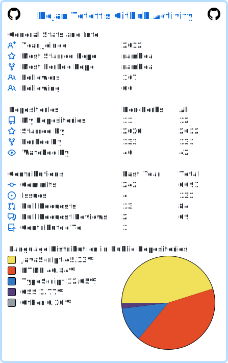

<!-- https://github-profile-summary-cards.vercel.app/demo.html -->

 

 
 

<!-- https://github.com/tuhinpal/readme-stats-github/blob/main/README.md -->

 

<!--START_SECTION:activity-->
1. 🗣 Commented on [#766](https://github.com/selfrefactor/rambda/issues/766#issuecomment-2816581591) in [selfrefactor/rambda](https://github.com/selfrefactor/rambda)
<!--END_SECTION:activity-->

  

