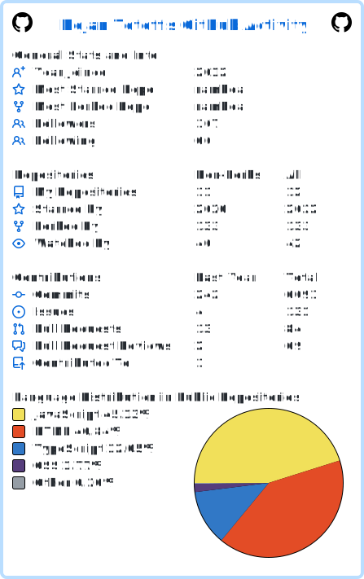

<!-- https://github-profile-summary-cards.vercel.app/demo.html -->

 

 
 

<!-- https://github.com/tuhinpal/readme-stats-github/blob/main/README.md -->

<!-- style options - https://raw.githubusercontent.com/catppuccin/github-readme-stats/main/README.md -->
  

[https://metrics.lecoq.io/selfrefactor](https://www.githubtrends.io/wrapped/selfrefactor)

 
