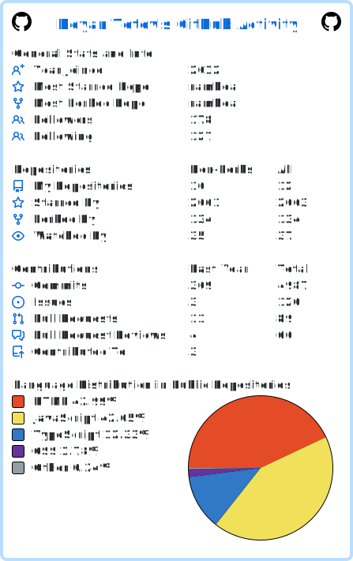

  

<!-- https://github-profile-summary-cards.vercel.app/demo.html -->

<!-- https://github.com/tuhinpal/readme-stats-github/blob/main/README.md -->

<!--START_SECTION:activity-->
1. 🔒 Closed issue [#798](https://github.com/selfrefactor/rambda/issues/798) in [selfrefactor/rambda](https://github.com/selfrefactor/rambda)
<!--END_SECTION:activity-->

